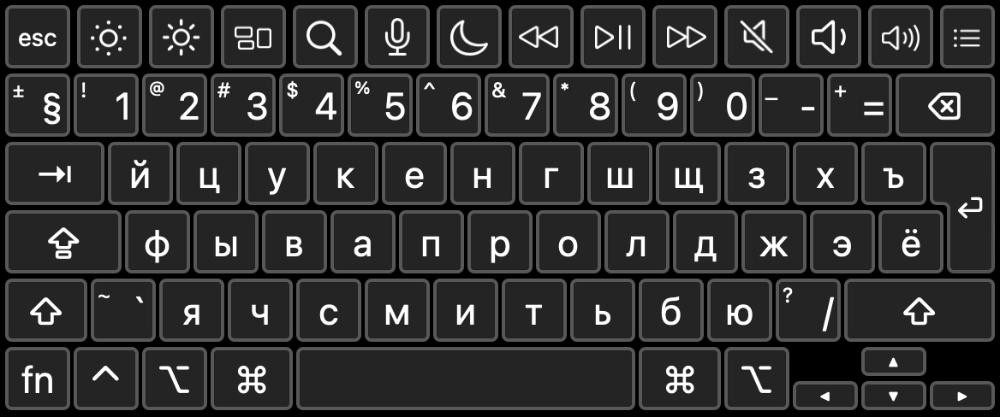
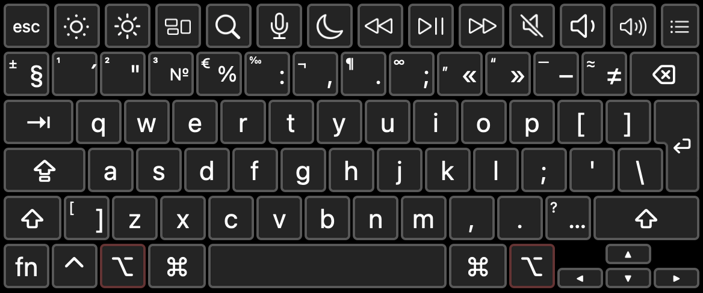
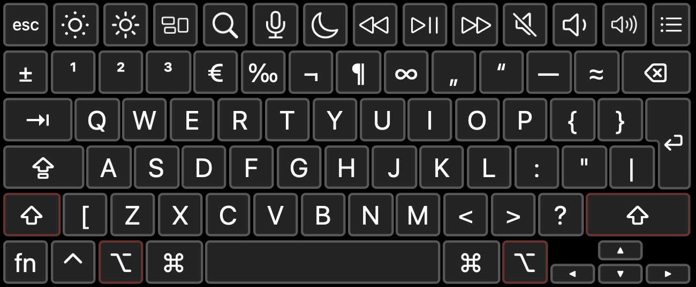
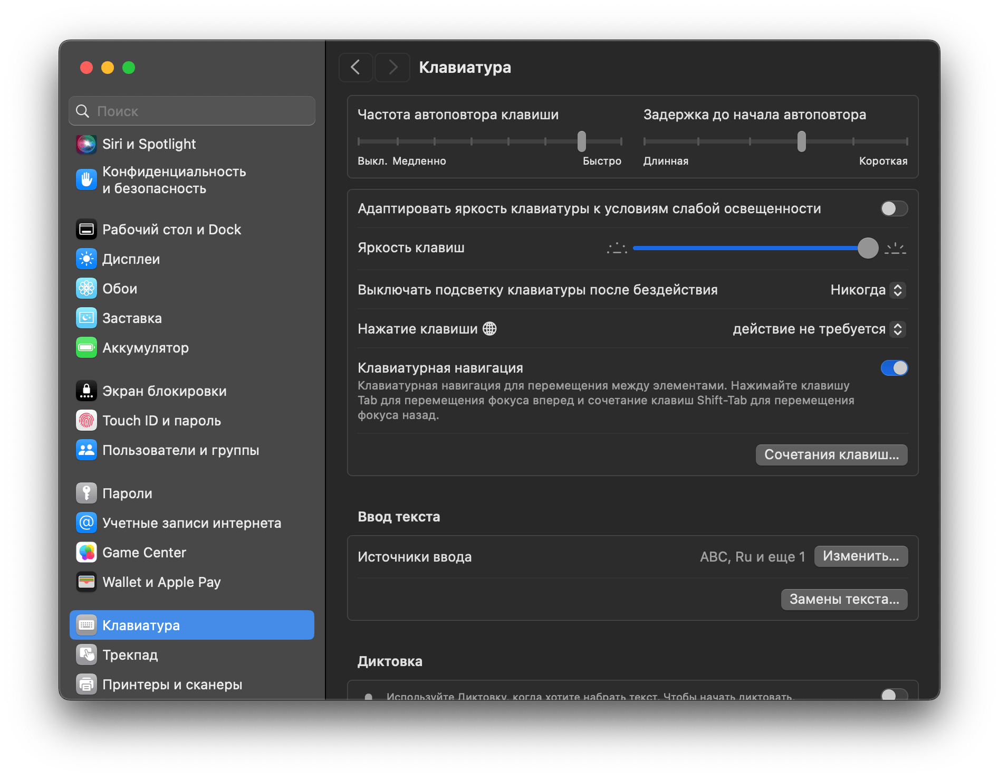
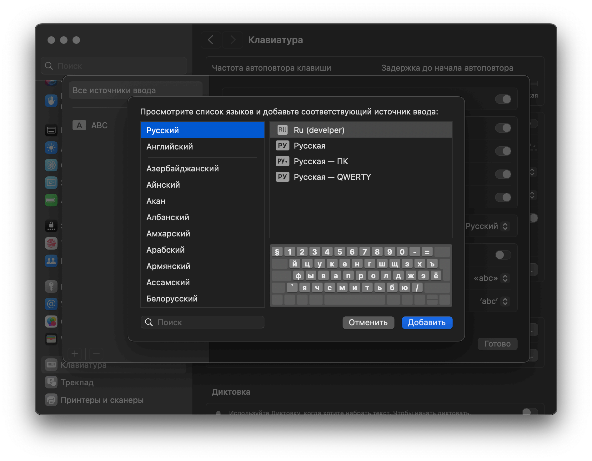
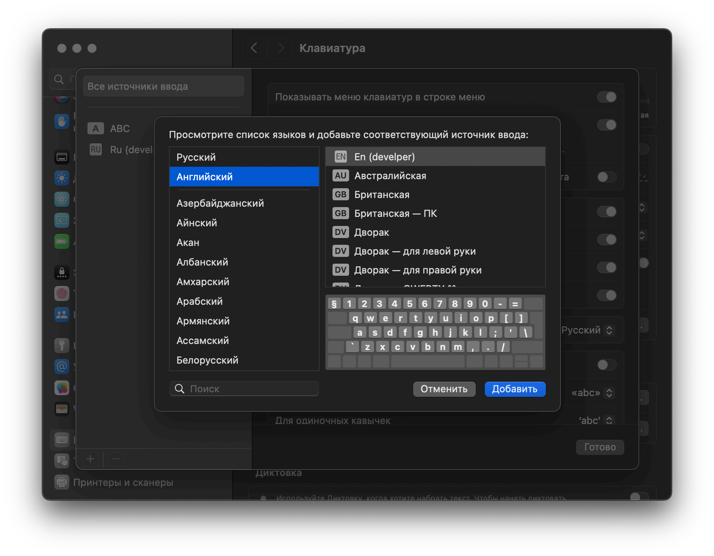
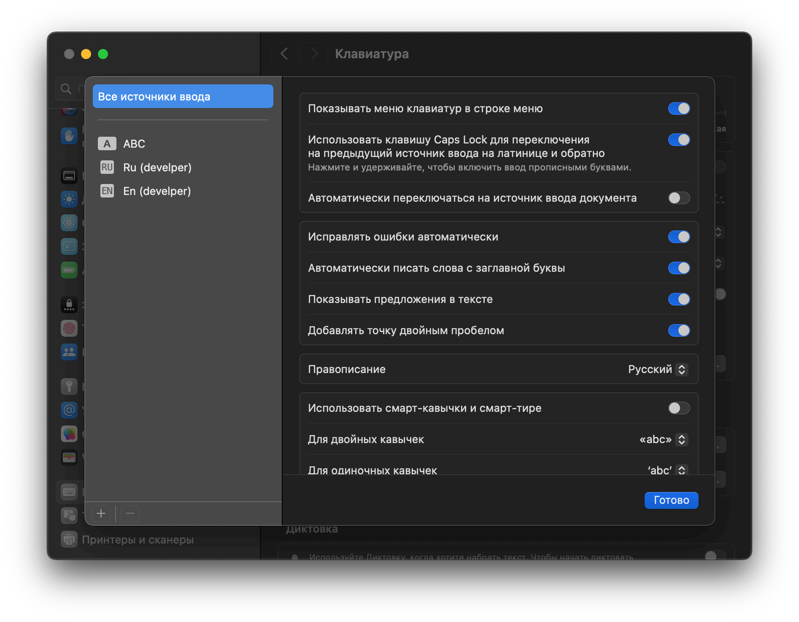

# Раскладка для разработчика

Обычная раскладка клавиатуры под macOS для русского и английского языка очень неудобная для разработчика, так как постоянно приходится переключаться между ними, для ввода нужных символов. Особенно при наборе документации, особенно, когда дело касается знаков препинания.

Что в этой раскладке не так, как в стандартной? 

Теперь есть 2 раскладки разработчика — RU + EN, где точка и запятая в едином месте в обоих раскладках (вводим с удерживанием клавиши `option`), кроме того, символы на цифрах в обеих раскладках тоже одинаковы, как и квадратные/фигурные скобки и кавычки с двоеточием.

Помимо того, что теперь знаки препинания на своих местах, разработчик часто оказывается в ситуации, что пока набирает русский текст, ему нужно срочно временно что-то ввести на английском. Теперь это возможно сделать без переключения языка, просто удерживая клавишу `option`.

Ну и как водится, если еще добавить `shift`, то будут заглавные буквы. Однако кроме них, стоит обратить внимания на цифровой ряд, так как при удержании `shift` появляются новые символы — степени, бесконечность, кавычки-лапки, тире вместо дефиса.

А еще я добавил знак ударения для сочетания клавиш `option+1`, теперь для того, чтобы его ввести надо встать за ударной гласной и нажать эту комбинацию.

## Установка и удаление

Раскладки клавиатуры хранятся в macOS в папке `~/Library/Keyboard Layouts`. Чтобы попасть в эту папку `~/Library`, нажмите в Finder `Command`+`Shift`+`G` и введите `~/Library/Keyboard Layouts`, после чего перейдите в папку. В неё надо скопировать файл `developer.keyboard.layout.bundle` и далее открыть «Системные настройки» и перейти к разделу «Клавиатура».

В «Источники ввода» нажмите кнопку «Изменить» и поочередно добавьте раскладку Ru (developer)

и En (developer)

Все, теперь можно пользоваться новыми раскладками.

Иногда, после копирования файла `developer.keyboard.layout.bundle` раскладка может не появиться в настройках, чтобы это исправить, надо перезагрузить macOS.

Для удаления, просто удалите файл раскладки из `~/Library/Keyboard Layouts`.
